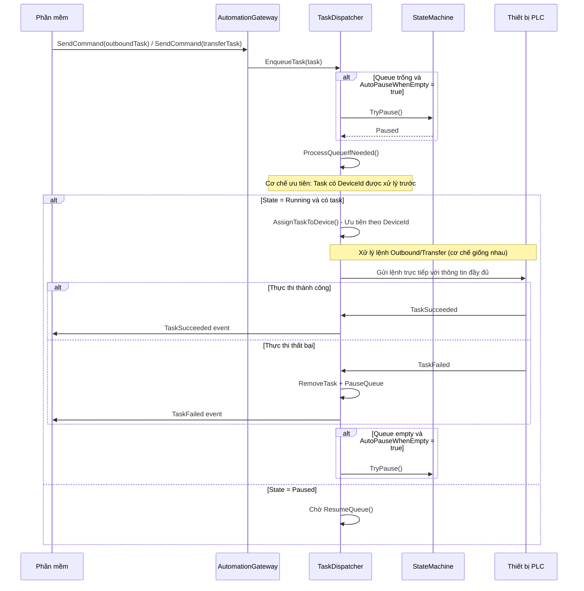
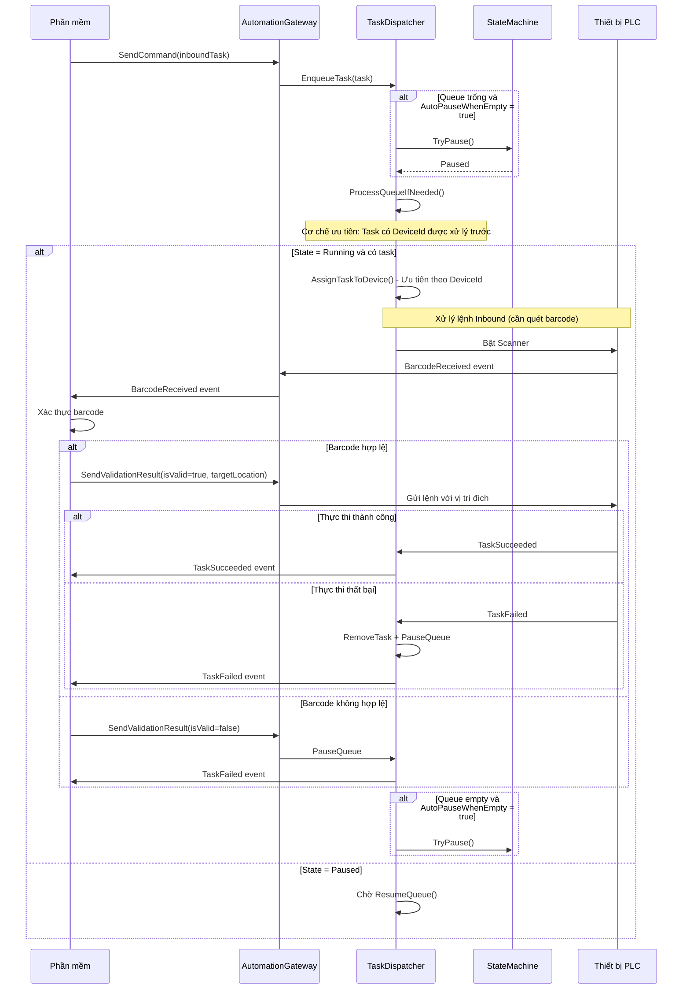
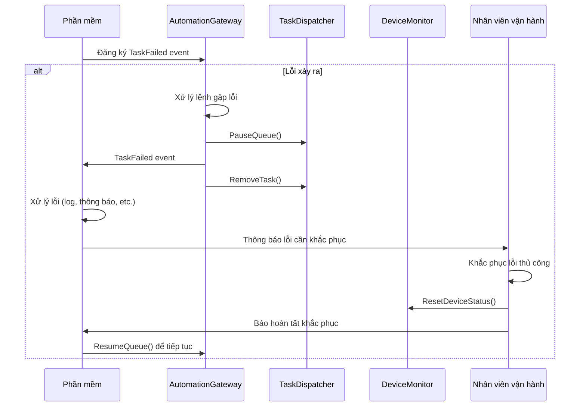

# TQG Automation SDK

## Tổng quan

TQG Automation SDK cung cấp giải pháp tích hợp hoàn chỉnh cho hệ thống tự động hóa kho bãi, hỗ trợ quản lý và điều khiển các thiết bị PLC thông qua giao diện lập trình đơn giản.

### Tính năng chính

- **Quản lý thiết bị thông minh**: Tự động giám sát trạng thái và kết nối PLC
- **Xử lý lệnh đa dạng**: Hỗ trợ nhập kho, xuất kho, chuyển kho với cấu trúc thống nhất
- **Xác thực mã vạch**: Tích hợp quy trình quét và xác thực mã vạch tự động
- **Quản lý hàng đợi tiên tiến**: Auto-pause/resume, ưu tiên task, timeout monitoring
- **Xử lý lỗi thông minh**: Cơ chế retry, logging chi tiết, exception handling toàn diện
- **Thread-safe**: Hỗ trợ đa luồng với state machine an toàn

**Namespace:** `TQG.Automation.SDK`  
**Assembly:** TQG.Automation.SDK

## Cấu trúc API

### AutomationGatewayBase

Lớp cơ sở để tương tác với các thiết bị PLC. Cung cấp chức năng core cho quản lý thiết bị, thực thi lệnh và xử lý barcode.

#### Constructor

```csharp
protected AutomationGatewayBase(IEnumerable<DeviceProfile> devices, ApplicationConfiguration config)
```

**Tham số:**
- `devices`: Danh sách cấu hình thiết bị (không được null)
- `config`: Cấu hình ứng dụng (không được null)

**Exceptions:**
- `ArgumentNullException`: Ném ra khi devices hoặc config là null
- `ArgumentException`: Ném ra khi có ID thiết bị trùng lặp trong danh sách devices
- `InvalidOperationException`: Ném ra khi tạo logger thất bại hoặc khởi tạo service thất bại
- `ObjectDisposedException`: Ném ra khi bất kỳ service nào đã bị dispose trong quá trình khởi tạo

#### Properties

| Property | Type | Mô tả |
|----------|------|-------|
| `DeviceConfigs` | `IReadOnlyDictionary<string, DeviceProfile>` | Lấy cấu hình các thiết bị |
| `ValidationChannel` | `Channel<BarcodeRequest>` | Kênh xử lý yêu cầu mã vạch |

#### Events

| Event | Mô tả |
|-------|-------|
| `BarcodeReceived` | Sự kiện phát sinh khi nhận được barcode từ thiết bị |
| `TaskSucceeded` | Sự kiện phát sinh khi nhiệm vụ hoàn thành thành công |
| `TaskFailed` | Sự kiện phát sinh khi nhiệm vụ thất bại |

## API Methods

### Quản lý thiết bị

#### `Task ActivateDevice(string deviceId)`

Kích hoạt thiết bị và bắt đầu giám sát trạng thái.

**Exceptions:**
- `ArgumentException`: Ném ra khi deviceId là null hoặc rỗng
- `DeviceNotRegisteredException`: Ném ra khi thiết bị không tồn tại
- `ObjectDisposedException`: Ném ra khi DeviceMonitor đã bị dispose
- `InvalidOperationException`: Ném ra khi thiết bị ở trạng thái không hợp lệ để kích hoạt
- `TimeoutException`: Ném ra khi thao tác đọc PLC bị timeout
- `PlcConnectionFailedException`: Ném ra khi không thể thiết lập kết nối PLC

#### `void DeactivateDevice(string deviceId)`

Vô hiệu hóa thiết bị và ngắt kết nối.

**Exceptions:**
- `ObjectDisposedException`: Ném ra khi DeviceMonitor đã bị dispose

#### `bool IsConnected(string deviceId)`

Kiểm tra trạng thái kết nối của thiết bị.

**Returns:** `true` nếu thiết bị đang kết nối (Idle hoặc Busy), ngược lại là `false`

**Exceptions:**
- `ObjectDisposedException`: Ném ra khi DeviceMonitor đã bị dispose

#### `DeviceStatus GetDeviceStatus(string deviceId)`

Lấy trạng thái hiện tại của thiết bị.

**Returns:** Trạng thái thiết bị (DeviceStatus). Trả về `DeviceStatus.Offline` nếu không tìm thấy

**Exceptions:**
- `ObjectDisposedException`: Ném ra khi DeviceMonitor đã bị dispose

#### `Task<bool> ResetDeviceStatusAsync(string deviceId)`

Đặt lại trạng thái thiết bị về Idle nếu không đang Busy và trạng thái PLC ổn định.

**Returns:** `true` nếu trạng thái được reset, `false` nếu thiết bị đang Busy, có alarm hoặc mã lỗi != 0

**Exceptions:**
- `ArgumentException`: Ném ra khi deviceId là null hoặc rỗng
- `ObjectDisposedException`: Ném ra khi DeviceMonitor đã bị dispose
- `TimeoutException`: Ném ra khi thao tác đọc PLC bị timeout
- `PlcConnectionFailedException`: Ném ra khi kết nối PLC thất bại

### Xử lý lệnh

#### `Task SendCommand(TransportTask task)`

Gửi một lệnh vận chuyển đơn lẻ.

**Exceptions:**
- `ArgumentNullException`: Ném ra khi task là null hoặc có targetLocation null
- `ArgumentException`: Ném ra khi task có taskId null hoặc rỗng
- `ObjectDisposedException`: Ném ra khi CommandSender đã bị dispose
- `InvalidOperationException`: Ném ra khi hàng đợi nhiệm vụ đã đầy hoặc phân bổ thiết bị thất bại
- `DeviceNotRegisteredException`: Ném ra khi thiết bị được phân bổ chưa được đăng ký
- `TimeoutException`: Ném ra khi thực thi lệnh bị timeout
- `PlcConnectionFailedException`: Ném ra khi kết nối PLC thất bại trong quá trình thực thi

#### `Task SendMultipleCommands(List<TransportTask> tasks)`

Gửi nhiều lệnh vận chuyển cùng lúc.

**Exceptions:**
- `ArgumentNullException`: Ném ra khi tasks là null hoặc chứa task có targetLocation null
- `ArgumentException`: Ném ra khi tasks rỗng hoặc chứa task có taskId null/rỗng
- `ObjectDisposedException`: Ném ra khi CommandSender đã bị dispose
- `InvalidOperationException`: Ném ra khi hàng đợi nhiệm vụ đã đầy hoặc phân bổ thiết bị thất bại
- `DeviceNotRegisteredException`: Ném ra khi thiết bị được phân bổ chưa được đăng ký
- `TimeoutException`: Ném ra khi thực thi lệnh bị timeout
- `PlcConnectionFailedException`: Ném ra khi kết nối PLC thất bại trong quá trình thực thi

#### `Task SendValidationResult(...)`

Gửi kết quả validation barcode đến thiết bị.

**Parameters:**
- `deviceId`: Mã định danh thiết bị cần gửi kết quả
- `taskId`: Mã định danh nhiệm vụ liên quan
- `isValid`: Kết quả validation barcode (true nếu hợp lệ)
- `targetLocation`: Vị trí đích (tùy chọn, bắt buộc nếu valid)
- `direction`: Hướng vào block (block có 2 hướng vào, ví dụ: block 3)
- `gateNumber`: Số cổng để vào kho

**Exceptions:**
- `ArgumentException`: Ném ra khi deviceId hoặc taskId là null hoặc rỗng
- `ObjectDisposedException`: Ném ra khi CommandSender đã bị dispose
- `DeviceNotRegisteredException`: Ném ra khi thiết bị chưa được đăng ký
- `InvalidOperationException`: Ném ra khi thao tác ghi PLC thất bại
- `TimeoutException`: Ném ra khi thao tác PLC bị timeout
- `PlcConnectionFailedException`: Ném ra khi kết nối PLC thất bại

### Quản lý hàng đợi

#### `void PauseQueue()`

Tạm dừng việc thực thi lệnh (các lệnh đang chạy vẫn tiếp tục cho đến khi hoàn thành).

**Exceptions:**
- `ObjectDisposedException`: Ném ra khi TaskDispatcher đã bị dispose

#### `void ResumeQueue()`

Tiếp tục việc thực thi lệnh cho các nhiệm vụ trong hàng đợi.

**Exceptions:**
- `ObjectDisposedException`: Ném ra khi TaskDispatcher đã bị dispose

#### `bool IsPauseQueue`

Kiểm tra xem hàng đợi hiện có đang bị tạm dừng hay không.

#### `TransportTask[] GetPendingTask()`

Lấy danh sách các nhiệm vụ đang chờ xử lý trong hàng đợi.

**Returns:** Danh sách các nhiệm vụ

**Exceptions:**
- `ObjectDisposedException`: Ném ra khi TaskDispatcher đã bị dispose

#### `bool RemoveTransportTasks(IEnumerable<string> taskIds)`

Xóa một hoặc nhiều nhiệm vụ khỏi hàng đợi.

**Returns:** `false` nếu danh sách rỗng hoặc queue không pause (IsPauseQueue = False), `true` nếu thành công

**Exceptions:**
- `ArgumentNullException`: Ném ra khi taskIds là null
- `ObjectDisposedException`: Ném ra khi TaskDispatcher đã bị dispose

#### `string? GetCurrentTask(string deviceId)`

Lấy TaskId đang được thực thi hiện tại.

**Returns:** TaskId hoặc null nếu không có nhiệm vụ đang chạy

**Exceptions:**
- `ObjectDisposedException`: Ném ra khi TaskDispatcher đã bị dispose

### Thông tin thiết bị

#### `Task<List<DeviceInfo>> GetIdleDevicesAsync()`

Lấy danh sách các shuttle đang rảnh rỗi cùng với vị trí hiện tại của chúng.

**Returns:** Danh sách các shuttle rảnh rỗi và vị trí hiện tại

**Exceptions:**
- `ObjectDisposedException`: Ném ra khi DeviceMonitor đã bị dispose
- `TimeoutException`: Ném ra khi thao tác đọc PLC bị timeout
- `PlcConnectionFailedException`: Ném ra khi kết nối PLC thất bại

#### `Task<Location?> GetActualLocationAsync(string deviceId)`

Lấy vị trí hiện tại của shuttle.

**Returns:** Vị trí hiện tại (Location) hoặc null nếu shuttle không hoạt động

**Exceptions:**
- `ArgumentException`: Ném ra khi deviceId là null hoặc rỗng
- `ObjectDisposedException`: Ném ra khi DeviceMonitor đã bị dispose
- `TimeoutException`: Ném ra khi thao tác đọc PLC bị timeout
- `PlcConnectionFailedException`: Ném ra khi kết nối PLC thất bại

### Reset hệ thống

#### `Task ResetSystemAsync(string deviceId)`

Đặt lại hệ thống về trạng thái ban đầu cho mục đích testing. Phương thức này chỉ nên được gọi ở test mode và yêu cầu các điều kiện bảo mật cụ thể.

**Returns:** Task đại diện cho thao tác reset bất đồng bộ

**Exceptions:**
- `ArgumentException`: Ném ra khi deviceId là null hoặc rỗng
- `InvalidOperationException`: Ném ra khi không ở test mode hoặc không thỏa mãn điều kiện bảo mật
- `DeviceNotRegisteredException`: Ném ra khi thiết bị chưa được đăng ký
- `ObjectDisposedException`: Ném ra khi DeviceMonitor đã bị dispose
- `TimeoutException`: Ném ra khi các thao tác PLC bị timeout
- `PlcConnectionFailedException`: Ném ra khi kết nối PLC thất bại

## Cấu hình hệ thống

### ApplicationConfiguration

Cấu hình chính của hệ thống Automation Gateway.

| Property | Type | Mô tả | Mặc định |
|----------|------|-------|----------|
| `Mode` | `string` | Chế độ hoạt động ("production" hoặc "test") | `"test"` |
| `Devices` | `List<DeviceProfile>` | Danh sách cấu hình thiết bị | `[]` |
| `DeviceMonitor` | `DeviceMonitorConfiguration` | Cấu hình giám sát thiết bị | Required |
| `BarcodeHandler` | `BarcodeHandlerConfiguration` | Cấu hình xử lý mã vạch | Required |
| `TaskDispatcher` | `TaskDispatcherConfiguration` | Cấu hình quản lý hàng đợi | Required |
| `TaskTimeout` | `TaskTimeoutConfiguration` | Cấu hình timeout cho task | Required |
| `Logger` | `LoggerConfiguration` | Cấu hình logging | Required |
| `Plc` | `PlcConfiguration` | Cấu hình PLC communication | Required |

**Properties:**
- `IsTestMode`: Kiểm tra chế độ test (true nếu Mode != "production")

#### DeviceMonitorConfiguration

| Property | Type | Mô tả | Mặc định |
|----------|------|-------|----------|
| `MaxConcurrentOperations` | `int` | Số lượng thao tác đồng thời tối đa | `10` |

#### BarcodeHandlerConfiguration

| Property | Type | Mô tả | Mặc định |
|----------|------|-------|----------|
| `ValidationTimeoutMinutes` | `int` | Timeout chờ xác thực mã vạch (phút) | `2` |
| `MaxBarcodeLength` | `int` | Độ dài tối đa của mã vạch | `10` |

#### TaskDispatcherConfiguration

| Property | Type | Mô tả | Mặc định |
|----------|------|-------|----------|
| `AutoPauseWhenEmpty` | `bool` | Tự động pause khi queue trống | `true` |
| `MaxQueueSize` | `int` | Kích thước tối đa của hàng đợi | `50` |
| `MaxTasksPerCycle` | `int` | Số task tối đa xử lý trong một chu kỳ | `10` |

#### TaskTimeoutConfiguration

| Property | Type | Mô tả | Mặc định |
|----------|------|-------|----------|
| `InboundTimeoutMinutes` | `int` | Timeout cho lệnh Inbound (phút) | `15` |
| `OutboundTimeoutMinutes` | `int` | Timeout cho lệnh Outbound (phút) | `15` |
| `TransferTimeoutMinutes` | `int` | Timeout cho lệnh Transfer (phút) | `15` |

**Methods:**
- `GetTimeoutMinutes(CommandType)`: Lấy timeout cho loại lệnh cụ thể
- `Validate()`: Kiểm tra tính hợp lệ của cấu hình

#### LoggerConfiguration

| Property | Type | Mô tả | Mặc định |
|----------|------|-------|----------|
| `MinimumLevel` | `LogLevel` | Mức log tối thiểu | `Information` |
| `EnableConsoleOutput` | `bool` | Bật output console | `false` |
| `EnableFileOutput` | `bool` | Bật output file | `true` |
| `EnableDebugOutput` | `bool` | Bật debug output | `true` |
| `IncludeTimestamp` | `bool` | Bao gồm timestamp | `true` |
| `IncludeComponentName` | `bool` | Bao gồm tên component | `true` |

**Static Properties:**
- `LoggerConfiguration.Test`: Cấu hình cho test mode
- `LoggerConfiguration.Production`: Cấu hình cho production mode
- `LoggerConfiguration.Development`: Cấu hình cho development mode
- `LoggerConfiguration.Silent`: Cấu hình tắt logging

#### PlcConfiguration

| Property | Type | Mô tả | Mặc định |
|----------|------|-------|----------|
| `ReadTimeoutSeconds` | `int` | Timeout đọc PLC (giây) | `5` |
| `WriteTimeoutSeconds` | `int` | Timeout ghi PLC (giây) | `5` |
| `MaxConnectionRetries` | `int` | Số lần retry kết nối tối đa | `3` |
| `RetryDelaySeconds` | `int` | Thời gian chờ giữa các lần retry (giây) | `1` |

### Cấu hình từ file JSON

#### Hướng dẫn đọc cấu hình từ JSON

```csharp
using System.Text.Json;

public class AutomationService
{
    private readonly AutomationGateway _gateway;

    public AutomationService()
    {
        string json = File.ReadAllText("appsettings.json");
        
        var config = JsonSerializer.Deserialize<ApplicationConfiguration>(json, new JsonSerializerOptions
        {
            PropertyNameCaseInsensitive = true
        }) ?? new ApplicationConfiguration();
        
        // Khởi tạo gateway
        if (!AutomationGateway.IsInitialized)
        {
            _gateway = AutomationGateway.Initialize(config);
        }
        else
        {
            _gateway = AutomationGateway.Instance;
        }

        // Hoặc:
        // _gateway = AutomationGateway.Initialize(json);

        // Đăng ký events
        _gateway.BarcodeReceived += OnBarcodeReceived;
        _gateway.TaskSucceeded += OnTaskSucceeded;
        _gateway.TaskFailed += OnTaskFailed;
    }
}
```

#### Cấu trúc JSON

```json
{
  "Mode": "production",
  "Devices": [
    {
      "Id": "Shuttle01",
      "TestEndpoint": "tcp://127.0.0.1:5021",
      "ProductionEndpoint": "192.168.4.102",
      "Cpu": "S71200",
      "Rack": 0,
      "Slot": 1,
      "Signals": {
        "InboundCommand": "DB66.DBX0.0",
        "OutboundCommand": "DB66.DBX0.1",
        "TransferCommand": "DB66.DBX0.2",
        "StartProcessCommand": "DB66.DBX0.3",
        "CommandAcknowledged": "DB66.DBX0.4",
        "CommandRejected": "DB66.DBX0.5",
        "InboundComplete": "DB66.DBX0.6",
        "OutboundComplete": "DB66.DBX0.7",
        "TransferComplete": "DB66.DBX1.0",
        "Alarm": "DB66.DBX1.1",
        "InDirBlock": "DB66.DBX1.3",
        "OutDirBlock": "DB66.DBX1.2",
        "GateNumber": "DB66.DBW2",
        "SourceFloor": "DB66.DBW4",
        "SourceRail": "DB66.DBW6",
        "SourceBlock": "DB66.DBW8",
        "TargetFloor": "DB66.DBW10",
        "TargetRail": "DB66.DBW12",
        "TargetBlock": "DB66.DBW14",
        "BarcodeValid": "DB66.DBX20.0",
        "BarcodeInvalid": "DB66.DBX20.1",
        "ActualFloor": "DB66.DBW22",
        "ActualRail": "DB66.DBW24",
        "ActualBlock": "DB66.DBW26",
        "ErrorCode": "DB66.DBW28",
        "BarcodeChar1": "DB66.DBW30",
        "BarcodeChar2": "DB66.DBW32",
        "BarcodeChar3": "DB66.DBW34",
        "BarcodeChar4": "DB66.DBW36",
        "BarcodeChar5": "DB66.DBW38",
        "BarcodeChar6": "DB66.DBW40",
        "BarcodeChar7": "DB66.DBW42",
        "BarcodeChar8": "DB66.DBW44",
        "BarcodeChar9": "DB66.DBW46",
        "BarcodeChar10": "DB66.DBW48",
        "DeviceReady": "DB66.DBX52.0",
        "ConnectedToSoftware": "DB66.DBX52.1"
      }
    }
  ],
  "BarcodeHandler": {
    "ValidationTimeoutMinutes": 2,
    "MaxBarcodeLength": 10
  },
  "DeviceMonitor": {
    "MaxConcurrentOperations": 10
  },
  "TaskDispatcher": {
    "MaxTasksPerCycle": 10,
    "AutoPauseWhenEmpty": true,
    "MaxQueueSize": 50
  },
  "TaskTimeout": {
    "InboundTimeoutMinutes": 15,
    "OutboundTimeoutMinutes": 15,
    "TransferTimeoutMinutes": 15
  },
  "Plc": {
    "ReadTimeoutSeconds": 10,
    "WriteTimeoutSeconds": 10,
    "MaxConnectionRetries": 5,
    "RetryDelaySeconds": 2
  }
}
```

## Cấu trúc dữ liệu

### DeviceProfile
Cấu hình thiết bị PLC.

| Property | Type | Mô tả |
|----------|------|-------|
| `Id` | `string` | Định danh duy nhất (required) |
| `ProductionEndpoint` | `string` | Địa chỉ IP PLC production (required) |
| `TestEndpoint` | `string` | Địa chỉ IP PLC test (required) |
| `Cpu` | `CpuType` | Loại CPU (mặc định: S7-1200) |
| `Rack` | `short` | Thông số PLC (mặc định: 0) |
| `Slot` | `short` | Thông số PLC (mặc định: 1) |
| `Signals` | `SignalMap` | Địa chỉ các thanh ghi (required) |

**Methods:**
- `GetEndpoint(bool isTestMode)`: Lấy endpoint phù hợp theo mode

### TransportTask
Lệnh di chuyển pallet.

| Property | Type | Mô tả |
|----------|------|-------|
| `TaskId` | `string` | ID lệnh (required) |
| `DeviceId` | `string?` | ID thiết bị thực thi (optional) - **Có ưu tiên cao hơn** |
| `CommandType` | `CommandType` | Loại lệnh (Inbound/Outbound/Transfer) |
| `SourceLocation` | `Location?` | Vị trí nguồn (cho Outbound/Transfer) |
| `TargetLocation` | `Location?` | Vị trí đích (cho Transfer) |
| `GateNumber` | `short` | Số cửa xuất/nhập |
| `InDirBlock` | `Direction` | Hướng vào block (cho Transfer) |
| `OutDirBlock` | `Direction` | Hướng ra block (cho Outbound/Transfer) |

**Properties:**
- **Pure data structure**: TransportTask chỉ chứa thông tin cấu hình task, không có runtime state
- **Timeout được quản lý tập trung**: Thời gian timeout được cấu hình trong `TaskTimeoutConfiguration` theo loại lệnh
- **Execution state**: Trạng thái thực thi được quản lý bởi hệ thống, không lưu trong task object

#### Cơ chế ưu tiên DeviceId

**Task có DeviceId được chỉ định:**
- ✅ **Ưu tiên cao nhất**: Được assign trực tiếp đến thiết bị cụ thể
- ✅ **Không cần assignment**: Bỏ qua quá trình tìm kiếm thiết bị rảnh
- ✅ **Đảm bảo thực thi**: Thiết bị phải ở trạng thái Idle để nhận task
- ✅ **Sử dụng khi**: Cần kiểm soát chính xác thiết bị thực thi

**Task không có DeviceId:**
- ⚠️ **Ưu tiên thấp hơn**: Chờ assignment tự động
- ⚠️ **Cần assignment**: Hệ thống tìm thiết bị rảnh phù hợp
- ⚠️ **Linh hoạt hơn**: Có thể được assign đến bất kỳ thiết bị nào
- ⚠️ **Sử dụng khi**: Không quan trọng thiết bị cụ thể nào thực thi

### Location
Vị trí trong kho (record type).

| Property | Type | Mô tả |
|----------|------|-------|
| `Floor` | `short` | Tầng (1-7) |
| `Rail` | `short` | Dãy (1-24) |
| `Block` | `short` | Kệ (3, 5) |

### Enums

#### DeviceStatus
- `Offline`: Ngoại tuyến
- `Idle`: Sẵn sàng
- `Busy`: Đang thực thi
- `Error`: Đang gặp lỗi
- `Charging`: Đang sạc pin

#### CommandType
- `Inbound`: Nhập kho
- `Outbound`: Xuất kho
- `Transfer`: Chuyển kho

#### Direction
- `Bottom` (0): Hướng dưới
- `Top` (1): Hướng trên

### SignalMap
Địa chỉ các thanh ghi PLC để giao tiếp với thiết bị.

**Mô tả chung:**
- **Commands**: Các lệnh điều khiển (Inbound, Outbound, Transfer, StartProcess)
- **Status**: Trạng thái phản hồi (Acknowledged, Rejected, Complete, Alarm)
- **Location**: Thông tin vị trí (Source, Target, Actual)
- **Gate & Direction**: Cửa và hướng di chuyển
- **Barcode**: Thông tin mã vạch và xác thực
- **Error**: Mã lỗi và thông tin debug

**Lưu ý:** Tất cả địa chỉ thanh ghi được cấu hình theo chuẩn PLC Siemens S7 (DBX, DBW format).

**Các địa chỉ thanh ghi chính:**
- **Commands**: DB66.DBX0.0 - DB66.DBX0.3
- **Status**: DB66.DBX0.4 - DB66.DBX1.1
- **Direction**: DB66.DBX1.2 - DB66.DBX1.3
- **Gate**: DB66.DBW2
- **Source Location**: DB66.DBW4 - DB66.DBW8
- **Target Location**: DB66.DBW10 - DB66.DBW14
- **Barcode Status**: DB66.DBX20.0 - DB66.DBX20.1
- **Actual Location**: DB66.DBW22 - DB66.DBW26
- **Error Code**: DB66.DBW28
- **Barcode Characters**: DB66.DBW30 - DB66.DBW48

## Cơ chế ưu tiên Task

### Thứ tự ưu tiên xử lý

1. **Task có DeviceId được chỉ định** (Ưu tiên cao nhất)
   - Được assign trực tiếp đến thiết bị cụ thể
   - Bỏ qua quá trình tìm kiếm thiết bị rảnh
   - Thiết bị phải ở trạng thái Idle để nhận task
   - Xử lý ngay lập tức khi thiết bị sẵn sàng

2. **Task không có DeviceId** (Ưu tiên thấp hơn)
   - Chờ assignment tự động
   - Hệ thống tìm thiết bị rảnh phù hợp
   - Có thể được assign đến bất kỳ thiết bị nào
   - Xử lý sau khi các task có DeviceId hoàn thành

### Lợi ích của cơ chế ưu tiên

- **Kiểm soát chính xác**: Đảm bảo task quan trọng được thực thi bởi thiết bị cụ thể
- **Tối ưu hiệu suất**: Task có DeviceId không cần chờ assignment
- **Linh hoạt**: Vẫn hỗ trợ task tự động assignment khi không cần kiểm soát
- **Đảm bảo thứ tự**: Task ưu tiên được xử lý trước task thường

## Luồng xử lý lệnh

### 1. Luồng xử lý lệnh Xuất/Chuyển kho (Outbound/Transfer)



### 2. Luồng xử lý lệnh Nhập kho (Inbound)



## Cơ chế Pause/Resume

### Auto-Pause
- **Khi nào**: Queue trống và `AutoPauseWhenEmpty = true`
- **Mục đích**: Tiết kiệm tài nguyên khi không có task
- **Cách hoạt động**: StateMachine chuyển sang `Paused` state

### Manual Resume (Bắt buộc)
- **Khi nào**: Sau khi khắc phục lỗi thủ công
- **Mục đích**: Đảm bảo an toàn cho hệ thống robot
- **Cách hoạt động**: Phải gọi `ResumeQueue()` thủ công sau khi nhân viên vận hành xác nhận hoàn tất

### Manual Control
- **PauseQueue()**: Tạm dừng xử lý (các task đang chạy tiếp tục)
- **ResumeQueue()**: Tiếp tục xử lý hàng đợi (chỉ khi đã khắc phục lỗi)
- **IsPauseQueue**: Kiểm tra trạng thái hiện tại

### Lưu ý quan trọng
- **Không có Auto-Resume**: Hệ thống robot yêu cầu can thiệp thủ công khi có lỗi
- **Workflow an toàn**: Lỗi → Pause → Khắc phục thủ công → Resume
- **Đảm bảo chất lượng**: Nhân viên vận hành phải xác nhận trước khi tiếp tục

## Xử lý lỗi và Recovery


## Ví dụ sử dụng

### Khởi tạo Gateway

```csharp
public class AutomationService
{
    private readonly AutomationGateway _gateway;

    public AutomationService()
    {
        // Đọc cấu hình từ JSON
        string json = File.ReadAllText("appsettings.json");
        
        var config = JsonSerializer.Deserialize<ApplicationConfiguration>(json, new JsonSerializerOptions
        {
            PropertyNameCaseInsensitive = true
        }) ?? new ApplicationConfiguration();
        
        // Khởi tạo gateway với cấu hình (devices đã có trong config)
        if (!AutomationGateway.IsInitialized)
        {
            _gateway = AutomationGateway.Initialize(config);
        }
        else
        {
            _gateway = AutomationGateway.Instance;
        }

        // Đăng ký events
        _gateway.BarcodeReceived += OnBarcodeReceived;
        _gateway.TaskSucceeded += OnTaskSucceeded;
        _gateway.TaskFailed += OnTaskFailed;
    }
}
```

### Gửi lệnh

```csharp
// Lệnh nhập kho (không chỉ định DeviceId - ưu tiên thấp)
var inboundTask = new TransportTask
{
    TaskId = "INBOUND_001",
    CommandType = CommandType.Inbound,
    GateNumber = 1
    // DeviceId = null - sẽ được assign tự động
};

// Lệnh xuất kho (chỉ định DeviceId cụ thể - ưu tiên cao)
var outboundTask = new TransportTask
{
    TaskId = "OUTBOUND_001",
    CommandType = CommandType.Outbound,
    DeviceId = "SHUTTLE_01", // Chỉ định thiết bị cụ thể
    SourceLocation = new Location(1, 2, 3), // Floor, Rail, Block
    GateNumber = 2,
    OutDirBlock = Direction.Bottom
};

// Lệnh chuyển kho (chỉ định DeviceId cụ thể - ưu tiên cao)
var transferTask = new TransportTask
{
    TaskId = "TRANSFER_001",
    CommandType = CommandType.Transfer,
    DeviceId = "SHUTTLE_02", // Chỉ định thiết bị cụ thể
    SourceLocation = new Location(1, 2, 3), // Floor, Rail, Block
    TargetLocation = new Location(1, 2, 5), // Floor, Rail, Block
    GateNumber = 1,
    InDirBlock = Direction.Bottom,
    OutDirBlock = Direction.Bottom
};

// Gửi nhiều lệnh cùng lúc
// Thứ tự ưu tiên: outboundTask, transferTask (có DeviceId) → inboundTask (không có DeviceId)
var tasks = new List<TransportTask> { inboundTask, outboundTask, transferTask };
await _gateway.SendMultipleCommands(tasks);
```

### Cơ chế ưu tiên trong thực tế

```csharp
// Scenario 1: Task có DeviceId được xử lý trước
var highPriorityTask = new TransportTask
{
    TaskId = "URGENT_001",
    DeviceId = "SHUTTLE_01", // Chỉ định thiết bị
    CommandType = CommandType.Outbound,
    SourceLocation = new Location(1, 1, 3),
    GateNumber = 1,
    OutDirBlock = Direction.Bottom
};

// Scenario 2: Task không có DeviceId chờ assignment
var normalTask = new TransportTask
{
    TaskId = "NORMAL_001",
    // DeviceId = null - sẽ được assign tự động
    CommandType = CommandType.Inbound,
    GateNumber = 2
};

// Khi gửi cùng lúc, highPriorityTask sẽ được xử lý trước
await _gateway.SendMultipleCommands(new[] { normalTask, highPriorityTask });
```

### Xử lý sự kiện

```csharp
private async void OnBarcodeReceived(object? sender, BarcodeReceivedEventArgs e)
{
    try
    {
        // Xác thực barcode
        var isValid = await ValidateBarcodeAsync(e.Barcode);
        
        if (isValid)
        {
            // Lấy vị trí đích từ database
            var targetLocation = await GetTargetLocationAsync(e.Barcode);
            var direction = GetDirectionForLocation(targetLocation);
            var gateNumber = GetGateNumberForLocation(targetLocation);
            
            // Gửi kết quả xác thực
            await _gateway.SendValidationResult(
                e.DeviceId, 
                e.TaskId, 
                true, 
                targetLocation, 
                direction, 
                gateNumber
            );
        }
        else
        {
            // Barcode không hợp lệ
            await _gateway.SendValidationResult(
                e.DeviceId, 
                e.TaskId, 
                false, 
                null, 
                Direction.Bottom, 
                0
            );
        }
    }
    catch (Exception ex)
    {
        _logger.LogError(ex, "Lỗi xử lý barcode {Barcode} cho task {TaskId}", 
            e.Barcode, e.TaskId);
    }
}

private void OnTaskSucceeded(object? sender, TaskSucceededEventArgs e)
{
    _logger.LogInformation("Task {TaskId} hoàn thành thành công trên thiết bị {DeviceId}", 
        e.TaskId, e.DeviceId);
    
    // Cập nhật database, gửi thông báo, etc.
}

private void OnTaskFailed(object? sender, TaskFailedEventArgs e)
{
    _logger.LogError("Task {TaskId} thất bại trên thiết bị {DeviceId}: {Error}", 
        e.TaskId, e.DeviceId, e.ErrorDetail.GetFullMessage());
    
    // Xử lý lỗi, thông báo nhân viên, etc.
}
```

### Quản lý hàng đợi

```csharp
// Kiểm tra trạng thái
if (_gateway.IsPauseQueue)
{
    _logger.LogInformation("Hàng đợi đang tạm dừng - cần khắc phục lỗi thủ công");
}

// Tạm dừng xử lý (khi có lỗi)
_gateway.PauseQueue();

// Lấy danh sách task đang chờ
var pendingTasks = _gateway.GetPendingTask();
_logger.LogInformation("Có {Count} task đang chờ xử lý", pendingTasks.Length);

// Xóa task khỏi hàng đợi (nếu cần)
var taskIdsToRemove = new[] { "TASK_001", "TASK_002" };
var removed = _gateway.RemoveTransportTasks(taskIdsToRemove);
_logger.LogInformation("Đã xóa {Count} task khỏi hàng đợi", removed ? taskIdsToRemove.Length : 0);

// CHỈ tiếp tục sau khi nhân viên vận hành xác nhận hoàn tất khắc phục
// _gateway.ResumeQueue(); // Chỉ gọi khi đã khắc phục lỗi
```

### Workflow xử lý lỗi

```csharp
private void OnTaskFailed(object? sender, TaskFailedEventArgs e)
{
    _logger.LogError("Task {TaskId} thất bại trên thiết bị {DeviceId}: {Error}", 
        e.TaskId, e.DeviceId, e.ErrorDetail.GetFullMessage());
    
    // Tự động pause queue khi có lỗi
    _gateway.PauseQueue();
    
    // Thông báo nhân viên vận hành
    NotifyOperator($"Lỗi trên thiết bị {e.DeviceId}: {e.ErrorDetail.GetFullMessage()}");
    
    // Chờ nhân viên vận hành khắc phục và gọi ResumeQueue()
}

// Phương thức để nhân viên vận hành gọi sau khi khắc phục
public void ResumeAfterManualFix()
{
    _logger.LogInformation("Nhân viên vận hành xác nhận hoàn tất khắc phục");
    _gateway.ResumeQueue();
}
```

## Best Practices

### 1. Sử dụng DeviceId hiệu quả

#### Khi nên chỉ định DeviceId
```csharp
// ✅ Task quan trọng cần thiết bị cụ thể
var urgentTask = new TransportTask
{
    TaskId = "URGENT_001",
    DeviceId = "SHUTTLE_01", // Chỉ định thiết bị
    CommandType = CommandType.Outbound,
    SourceLocation = new Location(1, 1, 3),
    GateNumber = 1,
    OutDirBlock = Direction.Bottom
};

// ✅ Task cần kiểm soát chính xác
var controlledTask = new TransportTask
{
    TaskId = "CONTROLLED_001",
    DeviceId = "SHUTTLE_02", // Thiết bị gần vị trí nhất
    CommandType = CommandType.Transfer,
    SourceLocation = new Location(2, 5, 3),
    TargetLocation = new Location(2, 5, 5),
    GateNumber = 1,
    InDirBlock = Direction.Bottom,
    OutDirBlock = Direction.Bottom
};
```

#### Khi không cần chỉ định DeviceId
```csharp
// ✅ Task thường, không quan trọng thiết bị nào thực thi
var normalTask = new TransportTask
{
    TaskId = "NORMAL_001",
    // DeviceId = null - để hệ thống tự assign
    CommandType = CommandType.Inbound,
    GateNumber = 2
};

// ✅ Batch task, để hệ thống tối ưu assignment
var batchTasks = new List<TransportTask>
{
    new() { TaskId = "BATCH_001", CommandType = CommandType.Inbound, GateNumber = 1 },
    new() { TaskId = "BATCH_002", CommandType = CommandType.Inbound, GateNumber = 2 },
    new() { TaskId = "BATCH_003", CommandType = CommandType.Inbound, GateNumber = 3 }
};
```

### 2. Exception Handling
```csharp
try
{
    await _gateway.SendCommand(task);
}
catch (DeviceNotRegisteredException ex)
{
    _logger.LogError("Thiết bị {DeviceId} không được đăng ký", ex.DeviceId);
}
catch (TimeoutException ex)
{
    _logger.LogError("Lệnh timeout: {Message}", ex.Message);
}
catch (PlcConnectionFailedException ex)
{
    _logger.LogError("Không thể kết nối PLC: {Message}", ex.Message);
}
catch (Exception ex)
{
    _logger.LogError(ex, "Lỗi không xác định khi gửi lệnh");
}
```

### 3. Resource Management
```csharp
public class AutomationService : IDisposable
{
    private readonly AutomationGateway _gateway;
    private bool _disposed = false;

    public void Dispose()
    {
        if (!_disposed)
        {
            _gateway?.Dispose();
            _disposed = true;
        }
    }
}
```

### 4. Thread Safety
- Gateway instance có thể được sử dụng từ nhiều thread
- Events có thể được raise từ background threads
- Sử dụng thread-safe collections khi cần thiết

### 5. Performance Optimization
- Sử dụng `SendMultipleCommands` cho batch operations
- Cấu hình `AutoPauseWhenEmpty = true` để tiết kiệm tài nguyên
- Điều chỉnh `MaxTasksPerCycle` phù hợp với hệ thống
- Sử dụng timeout phù hợp cho từng loại lệnh

## Bảng mã lỗi

### Mã lỗi hệ thống (ErrorDetail)

| Mã lỗi | Tên phương thức | Mô tả |
|---------|-----------------|-------|
| 1001 | NotFoundTask | Không tìm thấy task pending response cho device |
| 1002 | MismatchedDevice | Device ID không khớp với expected device |
| 1003 | DeviceNotRegistered | Device không được đăng ký trong hệ thống |
| 1004 | PollingException | Lỗi khi polling thiết bị |
| 1006 | Timeout | Task bị timeout |
| 1007 | Unknown | Lỗi không xác định |
| 1008 | ExecutionException | Lỗi khi thực thi command |
| 1009 | ValidationException | Lỗi khi xử lý validation result |
| 1010 | TaskQueueFull | Hàng đợi task đã đầy |
| 1011 | PlcConnectionFailed | Kết nối PLC thất bại |

### Mã lỗi RunningFailure (từ thiết bị)

| Mã lỗi | Thông báo lỗi |
|---------|---------------|
| 1 | Shuttle Lift Time Over |
| 2 | Speed not set |
| 3 | Shuttle Stop Time Over |
| 4 | Shuttle Not Matching Block |
| 5 | Encountered an obstacle while changing lanes |
| 6 | Floor mismatch |
| 7 | Target location does not match |
| 8 | Shuttle not in Elevator |
| 9 | Shuttle lost connection |
| 10 | Pallet input location is full |
| 11 | RFID reader connection lost |
| 12 | Pallet not detected at pick location |
| 13 | Elevator Stop Time Over |
| 14 | Elevator coordinate limit exceeded |
| 15 | Warning: Pallet not meeting requirements |
| 16 | Conveyor Lift Motor Error |
| 17 | Gate No. 1 opening/closing time over |
| 18 | Gate No. 2 opening/closing time over |
| 19 | No Pallet Detected on Elevator |
| 20 | Invalid input/output location |
| 21 | Can't control Shuttle |
| 22 | Check position: Shuttle is not in correct position |
| 23 | Shuttle not on Elevator |
| 24 | Manual mode: required floor must be current floor |
| 25 | Inverter Error |
| 26 | Elevator reaches travel limit |
| 27 | QR code reader timeout |
| 28 | Timeout stop Conveyor 6 & 4 or 8 & 7 |
| 100 | Emergency stop |
| 101 | Shuttle Servo_1 Alarm |
| 102 | Shuttle Servo_2 Alarm |

### Cách sử dụng mã lỗi

```csharp
// Xử lý lỗi từ ErrorDetail
public void HandleTaskFailure(TaskFailedEventArgs e)
{
    var error = e.Error;
    Console.WriteLine($"Mã lỗi: {error.ErrorCode}");
    Console.WriteLine($"Thông báo: {error.ErrorMessage}");
    Console.WriteLine($"Thời gian: {error.Timestamp}");
    
    // Xử lý theo loại lỗi
    switch (error.ErrorCode)
    {
        case 1001: // NotFoundTask
            // Xử lý lỗi không tìm thấy task
            break;
        case 1003: // DeviceNotRegistered
            // Xử lý lỗi device không đăng ký
            break;
        case >= 1 and <= 102: // RunningFailure codes
            // Xử lý lỗi từ thiết bị
            HandleDeviceError(error.ErrorCode);
            break;
        default:
            // Xử lý lỗi khác
            break;
    }
}

private void HandleDeviceError(int errorCode)
{
    switch (errorCode)
    {
        case 100: // Emergency stop
            // Dừng khẩn cấp - cần can thiệp ngay lập tức
            EmergencyStopProcedure();
            break;
        case 101:
        case 102: // Servo alarm
            // Lỗi servo - kiểm tra cơ cấu chấp hành
            CheckServoSystem();
            break;
        case 9: // Shuttle lost connection
            // Mất kết nối shuttle - kiểm tra mạng
            CheckNetworkConnection();
            break;
        // Thêm các case khác theo nhu cầu
        default:
            LogDeviceError(errorCode);
            break;
    }
}
```

## Troubleshooting

### Lỗi thường gặp

1. **`InvalidOperationException` khi gọi `AutomationGateway.Instance`**
   - **Nguyên nhân**: Chưa khởi tạo gateway
   - **Giải pháp**: Gọi `AutomationGateway.Initialize()` trước

2. **`DeviceNotRegisteredException`**
   - **Nguyên nhân**: Thiết bị không có trong cấu hình
   - **Giải pháp**: Kiểm tra file cấu hình devices

3. **`TimeoutException`**
   - **Nguyên nhân**: PLC phản hồi chậm hoặc mất kết nối
   - **Giải pháp**: Tăng timeout hoặc kiểm tra kết nối mạng

4. **`PlcConnectionFailedException`**
   - **Nguyên nhân**: Không thể kết nối đến PLC
   - **Giải pháp**: Kiểm tra IP address, port, và cấu hình PLC
